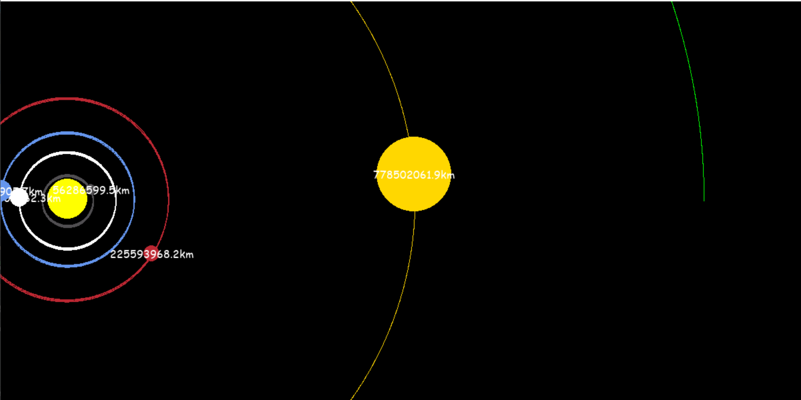

# Realistic Solar System Simulation

This is a simulation for solar system. Used exact values to calculate force, gravity, distance and other params.

## packages & libraries

- pygame
- math

## functions

- draw()
    - this function makes the mainframe and helps to set each element's position of the screen. also this makes what are
      the actual distances from planets to the sun.

- attraction()
    - this function calculates how to force each planet gravity with other planets. means, venus need more force to
      circulation because mercury gravity in addition sun's gravity.

- update_position()
    - this function calculates position changing all planets according to timestamp and updates the screen at 60fps.
      timestamp calculates 1ms equals 1 day in the real world
      
## licence
copyrights go to the [Tech with Tim](https://www.youtube.com/@TechWithTim) YouTube channel for the first 4 planets.

This project is licensed under the MIT LICENSE - see the [LICENSE](LICENSE) file for details.

© Copyright received by [kavindu kokila](mailto:kavindu.kokila.info@gmail.com)
